# SwarmUI AudioLab

AudioLab turns [SwarmUI](https://github.com/mcmonkeyprojects/SwarmUI) into a full audio workstation: text to speech,
speech to text, music and sound effect generation, voice conversion, stem separation, an always on wake word
listener, and a multi track DAW for arranging what you generate.

Everything runs **in process as pure C#** on the [HartsyInference](https://www.nuget.org/packages/HartsyInference)
engine, which ships with the extension as a NuGet dependency. There is no Python, no virtual environment, and no
Docker, and nothing to install beyond the extension itself.

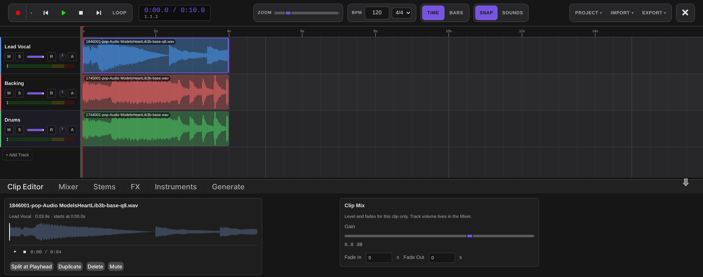

## Contents

- [Highlights](#highlights)
- [Requirements](#requirements)
- [Installation](#installation)
- [Quick start](#quick-start)
- [The Audio Backend](#the-audio-backend)
- [Engines and models](#engines-and-models)
- [The Audio Lab DAW](#the-audio-lab-daw)
- [Wake word listener](#wake-word-listener)
- [API reference](#api-reference)
- [Permissions](#permissions)
- [Network connections](#network-connections)
- [Roadmap](#roadmap)
- [Troubleshooting](#troubleshooting)
- [License and credits](#license-and-credits)

## Highlights

| | |
| --- | --- |
| **38 local engines, 79 models** | 20 text to speech, 6 speech to text, 7 music and sound effect, 3 voice conversion, 2 audio processing |
| **No Python** | Models load and run inside the SwarmUI process on the HartsyInference C# engine |
| **Install only what you want** | Per model Install and Remove, with Download All for multi variant engines |
| **Multi track DAW** | Timeline, mixer, effect chains, stem separation, drum machine, in place generation, saved sessions |
| **Wake word listener** | Voice satellites stream microphone audio in; detections are published on a WebSocket other extensions can subscribe to |
| **Works like any Swarm model** | Pick an audio model in the Generate tab, type a prompt, and the result lands in your output history |
| **Streaming speech** | Chunked text to speech plays back while it is still generating |
| **Sheet music editing** | Read back the score YuE2 plans, edit the notes and harmony, audition it in the browser, and render the change |

## Requirements

- SwarmUI, installed and working.
- `ffmpeg` on your PATH, for audio decode and encode and for the video plus audio endpoints.
- A CUDA or Vulkan GPU is recommended. Several models (Kokoro, Piper, Pocket TTS, Moonshine) run acceptably on CPU.

That is the whole list. The inference engine is a NuGet package AudioLab depends on directly, so it is restored and
copied into the extension's own output when the extension builds. There is nothing to install alongside it, and no
other extension to add.

Audio weights are stored under your Swarm model root, in `<ModelRoot>/audio`. There is no separate path setting to
keep in sync: AudioLab follows `Server` > `Server Configuration` > `Paths` > `ModelRoot`.

## Installation

AudioLab is not on SwarmUI's built in extension list yet, so install it by hand:

```bash
cd /path/to/SwarmUI/src/Extensions/
git clone https://github.com/HartsyAI/SwarmUI-AudioLab.git
```

Then rebuild. Restarting alone is not enough, because extensions are compiled: run the `update` script in the Swarm
root, or launch with a `launch-dev` script, which rebuilds every time.

After the restart, open `Server` > `Backends`, press **Audio Backend**, and save. The backend registers itself with
no engines installed; you add those next.

## Quick start

1. Go to `Server` > `Backends` and expand the **Audio Backend** card.
2. Open a category, for example **Text-to-Speech**, and press **Install** on an engine. Kokoro TTS is a good first
   pick: about 200MB, roughly 1GB of VRAM, and fast enough to be pleasant.
3. Switch to the **Generate** tab and select the model, for example `Audio Models/Kokoro/default`.
4. Type what you want spoken into the prompt box and press **Generate**.

The result is a WAV in your normal output history, with the same metadata, sharing, and history behaviour as an
image. Audio specific parameters appear automatically for whichever model you selected.

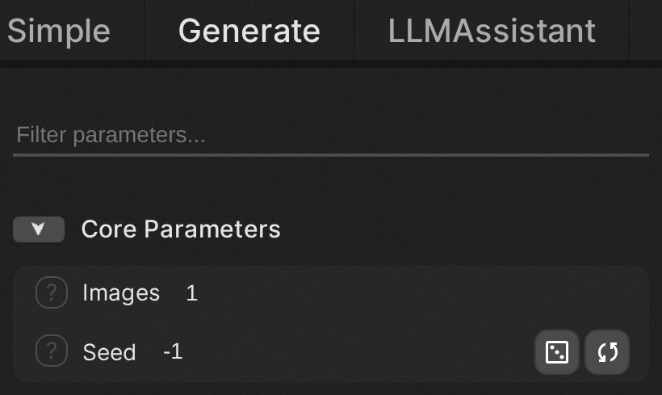

## The Audio Backend

AudioLab adds one backend type, **Audio Backend**. Add a single instance; it routes every audio category.

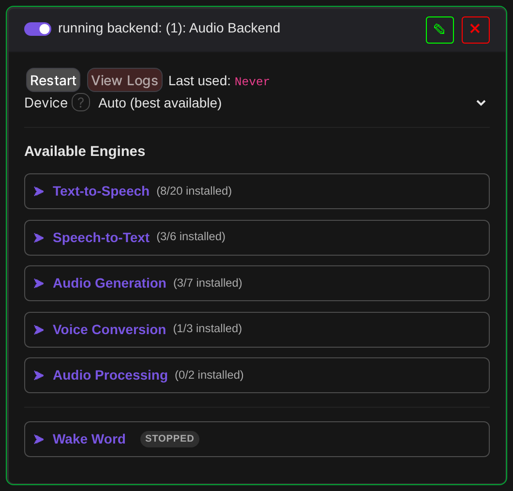

The card has one setting, **Device**, listing every compute backend the engine supports on your machine with one
entry per GPU. The list is built from the engine itself, so a backend it gains later appears here automatically:

```
Auto (best available)
CPU only (very slow)
GPU 0: NVIDIA GeForce RTX 3060 (11.6 GB)
Vulkan 0: NVIDIA GeForce RTX 3060 (12.2 GB)
Vulkan 1: llvmpipe (LLVM 15.0.7, 256 bits) (31.3 GB, software)
```

GPU numbering is the engine's own enumeration, which is fastest first for CUDA and need not match the order
`nvidia-smi` prints. Software rasterizers are labelled as such so you do not pick one by accident. `Auto` is
correct unless you are deliberately steering audio off a card another backend is using.

One thing to know: audio shares a single engine instance for the whole process, so `Device` is not really a per
backend choice. Run one audio backend, and restart SwarmUI to change devices once audio has run.

### Installing engines

Expanding a category lists its engines with VRAM, license, download size, and a status dot: green for installed,
grey for available.

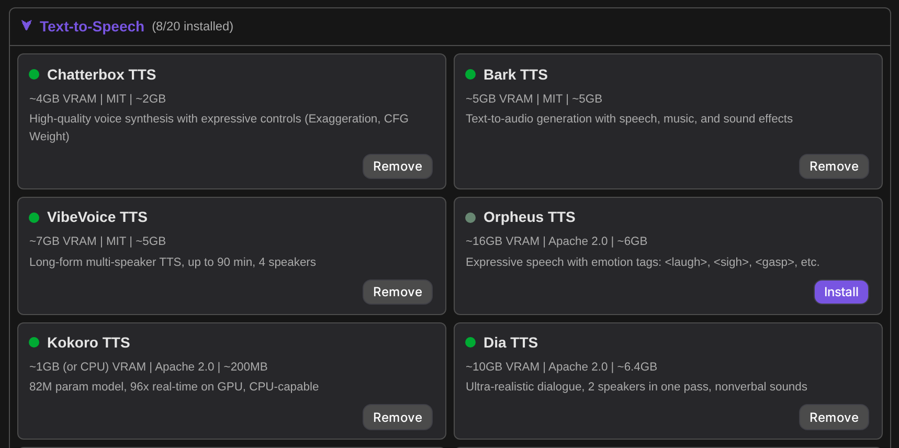

Engines that ship several checkpoints open a per model table, so you can take just the variant you want instead of
every one. ACE-Step, for example, has nine:

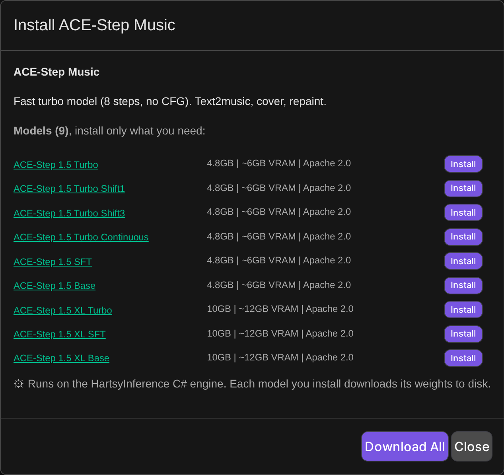

Most engines fetch their weights on first use. The ones that download discrete checkpoints get explicit **Install**
and **Remove** buttons per model, plus **Download All** and **Remove All**.

### Cloud API engines are currently disabled

AudioLab also carries definitions for 20 cloud providers (ElevenLabs, OpenAI, Google, Azure, Polly, Deepgram,
Cartesia, Play.ht, Suno, Udio, AssemblyAI, Dolby.io and others). **None of them are currently tested, so all of
them are disabled.** They appear greyed out, cannot be installed, and the server refuses install requests for them.

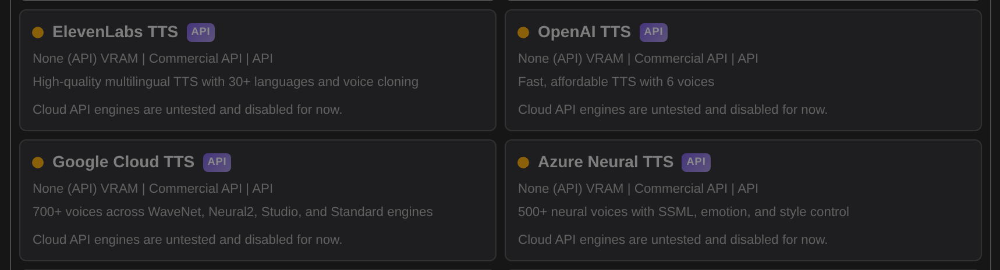

RealtimeSTT is disabled for a different reason: it has no C# engine implementation yet.

## Engines and models

Generated from the running server, so this is what the extension actually offers, not a wish list. "Weights" says
whether the engine downloads on first use or exposes per model installs.


#### Text to Speech (20 engines, 25 models)

| Engine | Models | VRAM | License | Weights |
| --- | --- | --- | --- | --- |
| [Bark TTS](https://huggingface.co/suno/bark) | 1 | ~5GB | MIT | on first use |
| [Chatterbox TTS](https://github.com/resemble-ai/chatterbox) | 1 | ~4GB | MIT | on first use |
| [CosyVoice TTS](https://huggingface.co/FunAudioLLM/CosyVoice2-0.5B) | 1 | ~8GB | Apache 2.0 | on first use |
| [CSM Conversational](https://huggingface.co/sesame/csm-1b) | 1 | ~4.5GB | Apache 2.0 | on first use |
| [Dia TTS](https://huggingface.co/nari-labs/Dia-1.6B-0626) | 1 | ~10GB | Apache 2.0 | on first use |
| [F5-TTS](https://huggingface.co/SWivid/F5-TTS) | 1 | ~4GB | CC-BY-NC-4.0 | on first use |
| [Fish Speech TTS](https://huggingface.co/fishaudio/fish-speech-1.5) | 1 | ~4GB | CC-BY-NC-SA-4.0 | on first use |
| [Kokoro TTS](https://huggingface.co/hexgrad/Kokoro-82M) | 1 | ~1GB (or CPU) | Apache 2.0 | on first use |
| [Kyutai TTS](https://huggingface.co/kyutai/tts-1.6b-en_fr) | 1 | ~8 GB | CC-BY 4.0 | on first use |
| [MeloTTS](https://huggingface.co/myshell-ai/MeloTTS-English-v3) | 1 | ~1GB (or CPU) | MIT | on first use |
| [NeuTTS Air](https://huggingface.co/neuphonic/neutts-air) | 1 | ~2GB (or CPU) | Apache 2.0 | on first use |
| [Orpheus TTS](https://huggingface.co/canopylabs/orpheus-3b-0.1-ft) | 1 | ~16GB | Apache 2.0 | on first use |
| [Piper TTS](https://github.com/rhasspy/piper) | 1 | CPU only | MIT | on first use |
| [Pocket TTS](https://github.com/kyutai-labs/pocket-tts) | 1 | CPU (no GPU needed) | CC-BY-4.0 | on first use |
| [Qwen3 TTS](https://huggingface.co/Qwen/Qwen3-TTS-12Hz-1.7B-Base) | 5 | ~4GB, ~8GB | Apache 2.0 | on first use |
| [Spark-TTS](https://huggingface.co/SparkAudio/Spark-TTS-0.5B) | 1 | ~4GB | CC-BY-NC-SA-4.0 | on first use |
| [StyleTTS 2](https://huggingface.co/yl4579/StyleTTS2-LibriTTS) | 1 | ~2GB | MIT | on first use |
| [VibeVoice TTS](https://huggingface.co/vibevoice/VibeVoice-1.5B) | 1 | ~7GB | MIT | on first use |
| [ZipVoice](https://huggingface.co/k2-fsa/ZipVoice) | 1 | ~2GB | Apache 2.0 | on first use |
| [Zonos TTS](https://huggingface.co/Zyphra/Zonos-v0.1-transformer) | 2 | ~4GB | Apache 2.0 | on first use |

#### Speech to Text (7 engines, 18 models)

| Engine | Models | VRAM | License | Weights |
| --- | --- | --- | --- | --- |
| [Distil-Whisper STT](https://huggingface.co/distil-whisper/distil-large-v3) | 2 | ~2GB | MIT | on first use |
| [Kyutai STT](https://huggingface.co/kyutai/stt-1b-en_fr-trfs) | 2 | ~3 GB, ~6 GB | CC-BY 4.0 | on first use |
| [Moonshine Streaming STT](https://huggingface.co/UsefulSensors/moonshine-streaming-tiny) | 3 | ~1.5GB to ~2GB | MIT | on first use |
| [Moonshine STT](https://huggingface.co/UsefulSensors/moonshine-base) | 2 | CPU only, ~1GB (or CPU) | MIT | on first use |
| [SheetSage2 Transcription](https://huggingface.co/Comfy-Org/YuE2) | 1 | ~4GB | CC-BY-NC-4.0 | on first use |
| [Whisper Streaming](https://huggingface.co/openai/whisper-base) | 1 | ~1GB (or CPU) | MIT | on first use |
| [Whisper STT](https://huggingface.co/openai/whisper-tiny) | 7 | ~10GB to ~6GB | Apache 2.0 / MIT | on first use |

#### Audio Generation (7 engines, 30 models)

| Engine | Models | VRAM | License | Weights |
| --- | --- | --- | --- | --- |
| [ACE-Step Music](https://github.com/ace-step/ACE-Step-1.5) | 9 | ~12GB, ~6GB | Apache 2.0 | installed per model |
| [AudioGen SFX](https://huggingface.co/facebook/audiogen-medium) | 1 | ~4GB | CC-BY-NC-4.0 | on first use |
| [HeartLib Music](https://huggingface.co/HeartMuLa/HeartMuLa-oss-3B-happy-new-year) | 9 | ~12GB (lazy load) to ~7GB | Apache-2.0 | on first use |
| [MiniMax Music 3](https://huggingface.co/MiniMaxAI/MiniMax-Music3) | 3 | ~10GB to ~22GB | CC-BY-NC-4.0 | on first use |
| [MusicGen](https://huggingface.co/facebook/musicgen-small) | 3 | ~10GB to ~6GB | CC-BY-NC-4.0 | on first use |
| [Stable Audio Open Small](https://huggingface.co/stabilityai/stable-audio-open-small) | 1 | ~3GB | Stability AI Community License | on first use |
| [YuE Music](https://huggingface.co/m-a-p/YuE-s1-7B-anneal-en-cot) | 4 | ~16GB (fp16) | Apache-2.0 | installed per model |
| [YuE2 Music](https://huggingface.co/Comfy-Org/YuE2) | 1 | ~9GB (bf16) | CC-BY-NC-4.0 | on first use |

#### Voice Conversion (3 engines, 3 models)

| Engine | Models | VRAM | License | Weights |
| --- | --- | --- | --- | --- |
| [GPT-SoVITS](https://github.com/RVC-Boss/GPT-SoVITS) | 1 | ~4GB | MIT | on first use |
| [OpenVoice V2](https://github.com/myshell-ai/OpenVoice) | 1 | ~2GB | MIT | on first use |
| [RVC Voice Conversion](https://github.com/RVC-Project/Retrieval-based-Voice-Conversion-WebUI) | 1 | ~4GB | MIT | installed per model |

#### Audio Processing (2 engines, 4 models)

| Engine | Models | VRAM | License | Weights |
| --- | --- | --- | --- | --- |
| [Demucs Separation](https://github.com/facebookresearch/demucs) | 2 | ~2GB | MIT | on first use |
| [Resemble Enhance](https://github.com/resemble-ai/resemble-enhance) | 2 | ~2GB | MIT | on first use |

### Verification status

Models are tested end to end through the SwarmUI API rather than in isolation: generate, decode the returned WAV,
and for speech run a Whisper round trip to compare the transcript against the input text.

[BENCHMARKS.md](BENCHMARKS.md) holds the detailed per model log: measured real time factors, VRAM peaks, word error
rates, and the specific reason for anything that does not work yet. It is a running record with dates on each pass,
so check it rather than assuming a model's state from this table.

The short version as of the most recent passes:

- **Speech to text is uniformly solid.** Every Whisper, Distil-Whisper, Moonshine and streaming variant transcribes
  on GPU at speeds in the faster-whisper reference range, with Moonshine tiny the fastest measured.
- **Most text to speech engines work and are word correct.** Kokoro, Chatterbox, Fish Speech, Kyutai TTS, Pocket
  TTS, Spark-TTS, StyleTTS 2 and Dia all produce intelligible, matching speech.
- **A few have caveats worth knowing** before you rely on them: Bark sounds staticy, F5-TTS is correct but slow,
  VibeVoice is a long form model that destabilizes on short prompts, and NeuTTS can append a garbled tail.
- **Some are gated on engine work** and refuse cleanly with a specific reason rather than failing at generation
  time: Piper, Zonos, MeloTTS and CosyVoice each need front end pieces the engine does not have yet.
- **Music generation works** across ACE-Step, MusicGen, AudioGen, HeartLib, YuE and YuE2, though the large
  autoregressive models are slow on consumer cards. YuE2 shares only its name with YuE: it plans an editable ABC
  score from your style tags and lyrics, then renders it to 48 kHz stereo, and its weights are non-commercial.
  Its duration is a hard token budget at 25 tokens a second, so a song asked for in under about 90 seconds
  usually stops mid-phrase — the UI says so when that happens.

### Measured speed

A sample of recorded figures on an RTX 3060 12GB, warm (model already loaded). RTF is generated audio seconds per
wall second, so above 1.0 is faster than real time. Full tables, rigs and methodology are in
[BENCHMARKS.md](BENCHMARKS.md); these are not re-measured for this README.

| Model | Type | RTF (warm) |
| --- | --- | --- |
| Moonshine tiny | STT | 12.7x |
| Whisper turbo | STT | 5.1x |
| Kokoro | TTS | 4.3x |
| Whisper large-v3 | STT | 3.8x |
| ACE-Step 1.5 turbo | Music | 1.33x |
| Qwen3 TTS 0.6B | TTS | 1.06x |
| Fish Speech 1.5 | TTS | 0.81x |
| Chatterbox | TTS | 0.50x |

The small speech models are launch bound rather than compute bound, so a faster GPU moves them very little.

Voice cloning models require a reference clip and will tell you so rather than guessing. Supply one through the
**Voice Reference** parameter group.

## The Audio Lab DAW

The **Audio Lab** tab is a multi track editor built around what you generate. Open it from the top tab bar, or from
the **Audio Lab** button on any audio result.

The transport strip carries record, play, stop, loop, a time or bars ruler, zoom, BPM and time signature, snap, and
the Project, Import and Export menus. Tracks have mute, solo, volume, pan, arm and a level meter; clips drag along
the timeline, snap to the grid, and can be split, duplicated, muted or deleted.

### Sessions

DAW work is saved three ways, and they are independent:

- **Autosave.** The current arrangement is continuously written to browser IndexedDB, including the audio itself, so
  a crashed tab or an accidental refresh does not lose work.
- **Local quick saves.** Named slots, also in IndexedDB, for fast checkpoints on the machine you are working on.
- **Server side projects.** `Project` > `Save`, `Save As`, and `Open` store named projects against your SwarmUI user
  account through the `AudioLabSaveProject` API, so they follow you between browsers and machines.

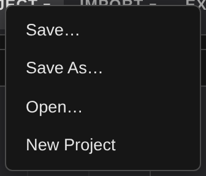

`New Project` clears the timeline and starts over.

### Clip Editor

Per clip gain, fade in and fade out, a waveform preview with its own transport, and Split at Playhead, Duplicate,
Delete and Mute. Track level volume stays in the Mixer, so clip gain and track gain do not fight each other.

### Mixer

One strip per track plus a master strip, each with pan, fader, level meter, mute and solo.

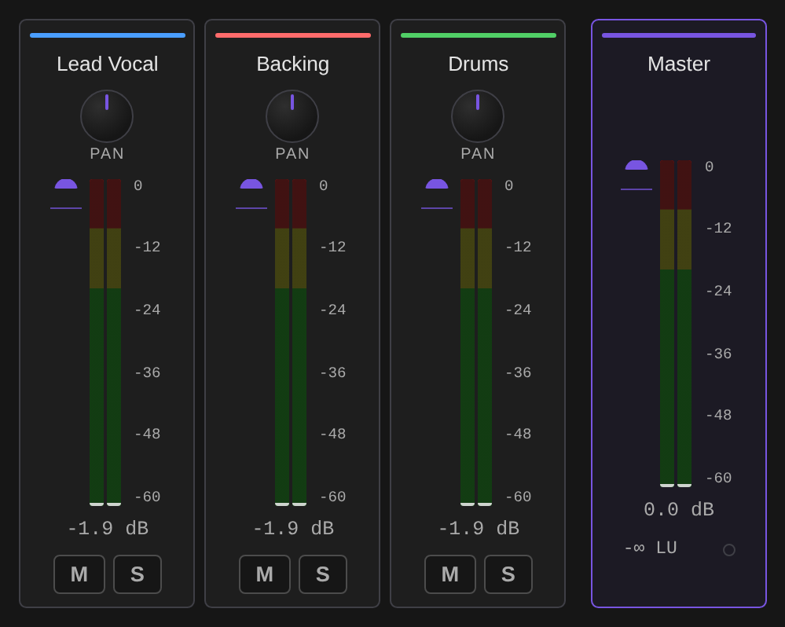

### FX

Per track effect chains built on the Web Audio API, so they are live and non destructive: EQ, Compressor, Reverb,
Delay and Saturation. Effects can be bypassed individually, reordered, or removed, and a chain can be saved and
loaded by name. There is a master limiter on the output.

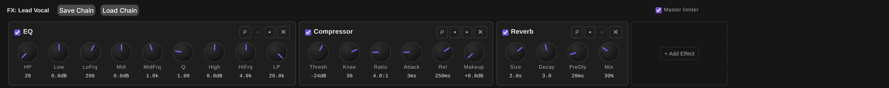

### Stems

Demucs source separation with presets for the common jobs: Full Split, Karaoke (vocals plus a combined
instrumental), Acapella, Instrumental, or Custom to pick exactly which stems you keep. Each stem chosen becomes a
new track in the arrangement.

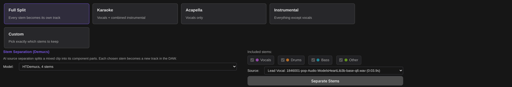

### Instruments

A 16 or 32 step drum machine with per lane gain, swing, audition, and Render to Track. Pads come from a generated
one shot, an imported sample, or the currently selected clip.

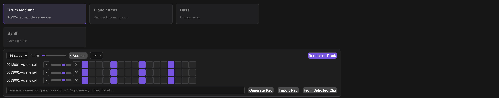

**Piano / Keys** plays into the [Score](#score) tab rather than rendering audio. Pick a voice, hit `Record into
score`, play the on-screen keyboard, and `Stop and write` quantizes what you played onto the score's grid and
writes it in at the playhead bar, spelled for the current key. A MIDI keyboard is offered too, but only where the
browser allows it: Web MIDI needs a secure context, so a SwarmUI reached at a LAN address over plain HTTP will not
have it. The on-screen keys work either way.

Bass and synth appear as slots in the instrument browser and are not built yet; see [Roadmap](#roadmap).

### Score

YuE2 cannot edit audio — it has no audio input at all. What it does have is the **ABC score** it writes before it
renders anything, and that score is editable. The Score tab is where you read it back, change it, and render the
change.

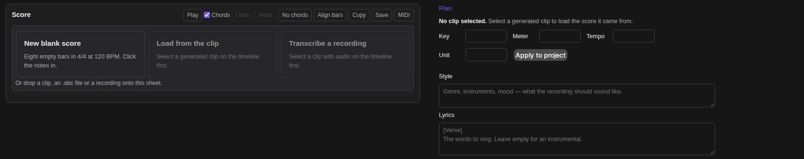

An empty tab shows what it can start from rather than a sentence about it. **New blank score** writes eight empty
bars in the project's own meter and tempo and hands you the staff to click notes into — nothing is generated and no
model is needed. **Load from the clip** and **Transcribe a recording** name the selected clip, or say what to select
instead. Dropping works too: a clip dragged off the timeline onto the sheet loads the score it carries, or offers to
read one off it; an `.abc` or `.txt` file opens as a score; a `.wav`, `.mp3` or `.flac` lands as a track and offers to
transcribe it.

A YuE2 generation made on the Generate tab carries its score too: **Open score** under the result opens the Audio
Lab with that plan already loaded, rather than leaving it as text in the metadata panel.

Select a clip a YuE2 generation produced and press **Load from clip**; the plan it performed appears as two staves,
`Vocal` and `Ins`, with its chord symbols. **Draft plan** asks the model for a score without rendering audio, which
is seconds rather than minutes. **Paste** takes one from anywhere.

**Transcribe clip** reads the score out of a recording instead: SheetSage2 listens and writes the melody, the
chord symbols, the key, the meter and the tempo. One listen returns two renderings — **Melody**, which is what a
cover is rendered from, and **Full**, which keeps the harmony. They are not a substitution apart, so the toggle
switches between the model's own two scores rather than deleting quoted text from one of them. **Cover this clip**
runs the whole loop: transcribe, keep the melody, render it in your Style. Separate a song in the **Stems** tab
first and **Transcribe vocal stem** reads the vocal alone, which is a cleaner melody than the mix. A long dense
clip can fill the decoder's context, and it says so and asks for a shorter section. SheetSage2 is about 1.4 GB
and stays loaded afterwards; **Free audio models after** drops it when the transcription finishes, which releases
every resident audio model rather than only this one — the engine has no per-model unload. SheetSage2's weights
are CC BY-NC 4.0, non-commercial only.

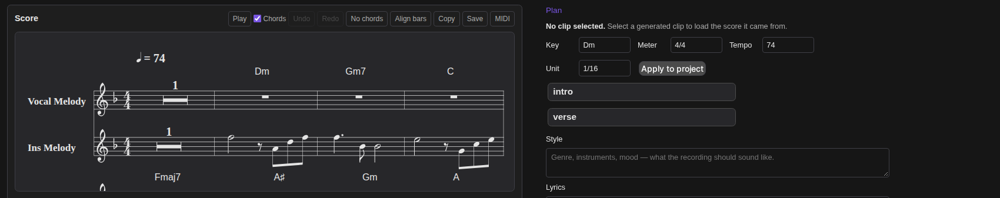

Everything is a text edit on the ABC, so there is one code path and one undo stack:

- Click a chord symbol to reharmonise it, click a note for its menu (length, split, merge, tie, accidental,
  octave, note to rest), or drag a note up and down to change its pitch.
- Sections come from the `%` comment lines. The chips rename, duplicate, reorder and delete whole sections, which
  keeps both voices in step by construction; dragging one chip onto another reorders them directly.
- **Melody by degree** takes `1155665 / 4433221` and writes the bars.
- **Edit with an LLM** rewrites the score to an instruction, with a scope and an invariant to hold fixed. It needs
  the [LLMAssistant](https://github.com/HartsyAI/SwarmUI-LLMAssistant) extension; without it the card says so.
- **Align bars** pads the source so the `Vocal` and `Ins` lines of a passage show the same bar in the same
  column, which makes a voice drifting out of step visible before the validator says so. It only ever adds
  spaces before a barline, so the score still says exactly what it did.
- Every edit is validated against YuE2's dialect first: two voices under the right ids, matching bar counts per
  chunk, every bar summing to the meter. Render stays disabled while an error stands. A bar whose durations do
  not add up is marked on the staff as well as listed, so it does not have to be hunted for.

**Play** auditions the plan in the browser — chords comped, notes highlighted as they sound — so a reharmonisation
can be judged in seconds instead of a render. It pauses and resumes where it stood, the progress bar under the
staff seeks on click, and the loop and tempo boxes repeat the plan or stretch it without editing the score, so
two harmonies can be compared against each other rather than each from bar one. Double-click a note to hear the
score from there. **Download samples** fetches the piano samples once so that works without the internet; until
then they come from the host abcjs ships with. **MIDI** exports the plan, **Save** writes a `.abc` file.

**Render** sends the score back with your Style and Lyrics and lands the result as a new track. The planning mode is
derived from the score, not chosen: chord symbols present means `full`, none means `melody`, which is the setting
covers want. **Render variants** sends the same score under several style lines, or several seeds, at once.

**Versions** is every clip carrying a score, drawn as the tree their `parent` links describe. Pick two and it tells
you what actually differs — chord symbols, bar count, whether any note moved — and **Solo A** / **Solo B** compare
them through the mixer's own solo.

**Apply to project** sets the project tempo and time signature to what the score is written in, and a section chip
jumps the playhead to that section in the clip the score came from — right-click still opens the section's menu.

Every field and control is named for a screen reader, the staff takes focus and shows it, and the validation
list announces itself when it changes, so the tab is usable without a mouse.

The score is a plan the model performs, not a recording of it. Do not read exact note realisation out of it.

### Generate

Generate straight into the arrangement without leaving the tab. Pick a category, pick one of your installed
engines, and the result is added as a new track at the playhead and saved to your outputs like any other
generation.

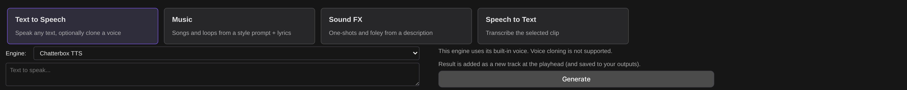

Categories are Text to Speech, Music, Sound FX and Speech to Text. The Speech to Text category transcribes the
selected clip, which is also how the transcript field fills itself.

### Export

`Export` renders the mixdown to WAV, MP3, OGG, FLAC or AAC, or straight back into your SwarmUI outputs.

## Wake word listener

AudioLab can hold an always on wake word listener. Voice satellites keep a connection open and stream microphone
audio; the engine scores it for the wake word, transcribes the command that follows, and identifies who spoke.

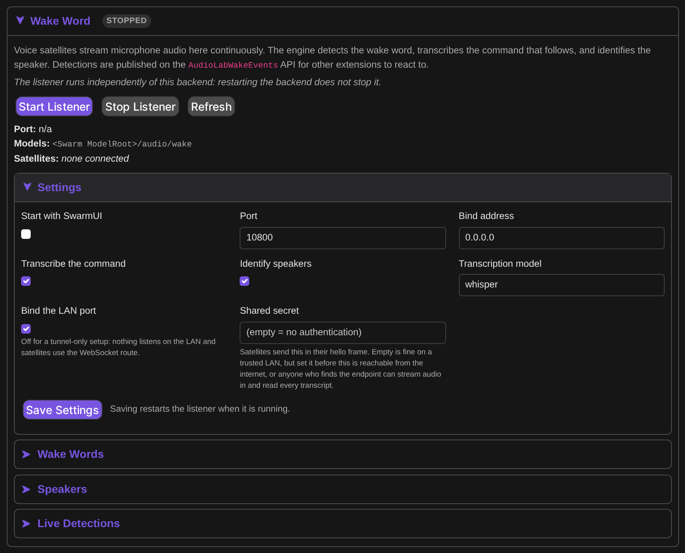

**It is off by default.** A SwarmUI install with no voice satellite never binds a port or holds a detection thread.
It lives in the **Wake Word** section of the Audio Backend card, under the engine list, because it is set up
once and then runs headless. Start it there, or set "Start with SwarmUI" to have it start with the server.

Its UI sits on the backend card, but the listener itself is not a backend and does not share that backend's
lifecycle: restarting or disabling the Audio Backend leaves the listener running. It holds its own small CPU
models, so it neither takes the shared generation lock nor competes for VRAM with audio generation.

### Satellites

Satellites connect two ways, with the same wire protocol either way, so firmware only changes transport:

- **Raw TCP** on the configured port, 10800 by default. Turn off "Bind the LAN port" and nothing listens on the LAN.
- **WebSocket**, through the `AudioLabWakeIngest` route. This exists because an HTTPS reverse proxy or tunnel cannot
  carry raw TCP but does carry WebSockets, so a satellite reaches the listener on the same hostname as the web UI.

> **Set the shared secret before exposing this beyond a trusted LAN.** Satellites send it in their hello frame. If
> it is empty the check is disabled, which is fine on a home network, but anyone who can reach the endpoint could
> otherwise stream audio in and read every detection, including transcripts of what was said.

### Words and speakers

Train a new wake word from its text in the **Wake Words** group. Training reports recall, false accept rate, false accepts per
hour and a suggested threshold, so you can judge a word before trusting it. Supply real room recordings as negative
audio; with too few negatives the false accept rate is unreliable.

Each word carries its own threshold, smoothing window, refractory period, a route tag, and optionally a required
speaker. Enrolled speakers are listed in the **Speakers** group, and a word can be restricted to one of them.
Enrollment itself is API-only for now: it needs recorded utterances, which `AudioLabWakeEnrollSpeaker` accepts as
base64 clips.

### Consuming detections

Detections are published for other extensions, which is the point of the feature. Each carries `device_id`, `word`,
`score`, `route`, `transcript`, `speaker` and `detected_at`.

- `AudioLabWakeEvents` is a WebSocket that streams them live.
- `AudioLabWakeRecentDetections` returns the recent buffer for consumers that cannot hold a socket open.
- `WakeWordService.Detected` is a plain C# event, for in process consumers that would rather not open a socket back
  into their own process.
- Configured webhook URLs receive a JSON POST per detection.

## API reference

AudioLab follows SwarmUI's API conventions exactly, so everything in the
[SwarmUI API docs](https://github.com/mcmonkeyprojects/SwarmUI/blob/master/docs/API.md) applies: routes are `POST`
to `(your server)/API/(route)` with JSON in and JSON out, every route except `GetNewSession` needs a `session_id`,
and routes marked WebSocket take a socket and stream progress.

Most responses carry `success`, plus `error` and `error_code` on failure.

### Generating audio

You usually do **not** need these endpoints. The canonical path is Swarm's own `GenerateText2Image`, with the audio
model as `model` and your text as `prompt`. The result lands in output history like any generation:

```bash
# 1. Get a session
curl -s -H "Content-Type: application/json" -d '{}' \
  -X POST http://localhost:7801/API/GetNewSession
# {"session_id":"<ID>", ...}

# 2. Generate speech, exactly like generating an image
curl -s -H "Content-Type: application/json" -X POST http://localhost:7801/API/GenerateText2Image \
  -d '{"session_id":"<ID>","images":1,
       "model":"Audio Models/Kokoro/default",
       "prompt":"As she sells seashells by the seashore."}'
# {"images":["View/local/raw/2026-08-18/....wav"]}
```

The direct endpoints below exist for callers that want base64 audio back instead of a file in history.

```bash
# Text to speech, returning base64 WAV
curl -s -H "Content-Type: application/json" -X POST http://localhost:7801/API/ProcessTTS \
  -d '{"session_id":"<ID>","provider_id":"kokoro_tts",
       "text":"Hello from AudioLab.","voice":"af_heart","volume":0.8,
       "options":{"speed":1.0,"format":"wav"}}'
# {"success":true,"audio_data":"<base64 wav>", ...}

# Speech to text
curl -s -H "Content-Type: application/json" -X POST http://localhost:7801/API/ProcessSTT \
  -d '{"session_id":"<ID>","provider_id":"whisper_stt",
       "audio_data":"<base64 wav>","language":"en-US"}'
# {"success":true,"transcription":"hello from audiolab", ...}
```

Voice cloning engines take `reference_audio` (base64 WAV) and, where the model needs it, `ref_text` alongside the
usual `ProcessTTS` fields.

### Routes

| Route | Kind | Permission | Parameters |
| --- | --- | --- | --- |
| `ProcessTTS` | POST | `audio_process` | `provider_id`, `text`, `voice`, `language`, `volume`, `options`, `reference_audio`, `ref_text` |
| `ProcessSTT` | POST | `audio_process` | `provider_id`, `audio_data`, `language`, `options` |
| `AudioLabTranscribeScore` | POST | `audio_process` | `audio_data` (mono 24 kHz WAV), `provider_id`, `model` |
| `AudioLabPlanScore` | POST | `audio_process` | `style`, `lyrics`, `duration`, `seed`, `cot`, `abc`, `budget_only` |
| `ProcessAudio` | POST | `audio_process` | `provider_id`, `args` |
| `ProcessWorkflow` | POST | `audio_process` | workflow steps |
| `ConvertAudioFormat` | POST | `audio_process` | `audio_data`, `format` |
| `AudioLabTimeStretch` | POST | `audio_process` | `audio_data`, `rate`, `semitones` |
| `CombineVideoAudio` | POST | `audio_process` | `video_data`, `audio_data`, `mode` |
| `ExtractAudioFromVideo` | POST | `audio_process` | `video_data` |
| `AudioLabListEngines` | POST | `audio_check_status` | none |
| `GetAllProvidersStatus` | POST | `audio_check_status` | none |
| `GetInstallationStatus` | POST | `audio_check_status` | none |
| `AudioLabInstallEngine` | WebSocket | `audio_manage_backends` | `provider_id`, `model_id` (optional) |
| `AudioLabInstallAllModels` | WebSocket | `audio_manage_backends` | `provider_id` |
| `AudioLabUninstallEngine` | POST | `audio_manage_backends` | `provider_id`, `delete_weights`, `model_id` |
| `AudioLabRemoveAllModels` | POST | `audio_manage_backends` | `provider_id` |
| `AudioLabSaveProject` | POST | `audio_daw_projects` | `name`, `project_json` |
| `AudioLabLoadProject` | POST | `audio_daw_projects` | `name` |
| `AudioLabListProjects` | POST | `audio_daw_projects` | none |
| `AudioLabDeleteProject` | POST | `audio_daw_projects` | `name` |
| `AudioLabWakeStatus` | POST | `audio_wake_listen` | none |
| `AudioLabWakeEvents` | WebSocket | `audio_wake_listen` | none |
| `AudioLabWakeRecentDetections` | POST | `audio_wake_listen` | none |
| `AudioLabWakeListWords` | POST | `audio_wake_listen` | none |
| `AudioLabWakeListSpeakers` | POST | `audio_wake_listen` | none |
| `AudioLabWakeIngest` | WebSocket | `audio_wake_listen` | satellite protocol frames |
| `AudioLabWakeGetSettings` | POST | `audio_wake_manage` | none |
| `AudioLabWakeSaveSettings` | POST | `audio_wake_manage` | `settings` |
| `AudioLabWakeStart` | POST | `audio_wake_manage` | none |
| `AudioLabWakeStop` | POST | `audio_wake_manage` | none |
| `AudioLabWakeConfigureWord` | POST | `audio_wake_manage` | `word`, `threshold`, `smoothing_window`, `refractory_seconds`, `route`, `required_speaker` |
| `AudioLabWakeTrainWord` | WebSocket | `audio_wake_manage` | `phrase`, `voices`, `negative_phrases`, `negative_audio`, `epochs` |
| `AudioLabWakeEnrollSpeaker` | POST | `audio_wake_manage` | `name`, `clips` (array of base64 WAV), `phrase` |
| `AudioLabWakeRemoveSpeaker` | POST | `audio_wake_manage` | `name` |

Reacting to wake detections from your own code is a WebSocket to `AudioLabWakeEvents`. It sends
`{"subscribed":true, ...}` on connect, then one `{"detection":{...}}` per hit, with a `{"keepalive":true}` every 30
seconds so an idle feed is not mistaken for a dead one.

## Permissions

AudioLab registers its permissions in an **AudioLab** group, so you can grant them per role under
`Server` > `Users`.

| Permission | Default | Covers |
| --- | --- | --- |
| `audio_process` | Power users | Running audio through any provider |
| `audio_manage_backends` | Power users | Installing and removing engines and model weights |
| `audio_check_status` | Power users | Listing engines and reading provider status |
| `audio_daw_projects` | Users | Saving and loading personal DAW projects |
| `audio_wake_listen` | Users | Reading wake status and subscribing to detections |
| `audio_wake_manage` | Power users | Starting and stopping the listener, training words, enrolling speakers |

`audio_wake_listen` is deliberately the lower bar: it is the permission another extension needs in order to react
to wake events.

## Network connections

Per SwarmUI's extension standards, here is every outbound connection AudioLab makes and why:

| Connection | When | Avoidable |
| --- | --- | --- |
| **huggingface.co** | Downloading model weights, on install or on first use | Yes, do not install engines. Nothing is fetched in the background otherwise |
| **Meta's public CDN** | Demucs stem separation weights, on first use | Yes, do not use stem separation |
| **Webhook URLs you configure** | One JSON POST per wake detection | Yes, leave the webhook list empty, which is the default |
| **paulrosen.github.io** | Piano samples for the Score tab's browser audition, one small mp3 per pitch | Yes, press `Download samples` once and they are served locally from then on |
| **Cloud provider APIs** | Not currently used at all, since every API engine is disabled | Not applicable |

No telemetry, no analytics, no update pings, no ads.

## Roadmap

Known and planned, so you can tell missing from broken:

- **More DAW instruments.** The drum machine and Piano / Keys ship today. Bass and synth are visible slots in the
  instrument browser and are not implemented; selecting one says so rather than failing silently. The piano roll
  itself is still to come — keys currently capture as a played phrase, not an editable grid.
- **Section markers on the timeline.** The Score tab knows a song's sections; the ruler still only draws the
  playhead and the loop region.
- **Cloud API engines.** All 20 provider definitions exist but none are tested, so all are disabled. They get
  re-enabled per provider as each is verified.
- **RealtimeSTT** needs a C# engine implementation.
- **Engine side gates.** Piper, Zonos, MeloTTS and CosyVoice are wired up and waiting on front end pieces from the
  engine. They light up on their own once those land.
- **Voice cloning for a few engines** (Chatterbox, NeuTTS, Spark-TTS) is waiting on encoder support; the default
  voice works meanwhile.
- **Performance.** The large autoregressive music models are slow on consumer GPUs and are an active optimization
  target. See BENCHMARKS.md for measured numbers.
- **LLM assisted music metadata.** ACE-Step's planner parameters exist but wait on SwarmUI's `AbstractLLMBackend`.

## Troubleshooting

**An engine says it is not installed but you installed it.** Its weights are not on disk any more, most likely
freed manually. AudioLab resets it to not installed and tells you; reinstall from the backend card.

**Changing the Device setting did nothing.** The audio engine is built once per process. Restart SwarmUI.

**A model refuses with a specific message about a missing front end.** That is an engine side gate, not a bug in
your setup. See [Roadmap](#roadmap); it will start working when the engine gains the piece it names.

**Changes to the extension are not showing up.** Extensions are compiled. Restarting SwarmUI is not enough on its
own unless you launch with a `launch-dev` script; otherwise run the `update` script.

**Out of memory when switching between large models.** AudioLab evicts other providers under memory pressure, but
host RAM, not VRAM, is usually the limit with multi gigabyte models. Close other heavy processes.

## License and credits

MIT. See [LICENSE](LICENSE).

Built by [Hartsy AI](https://github.com/HartsyAI) on top of [SwarmUI](https://github.com/mcmonkeyprojects/SwarmUI)
by mcmonkey, and the [HartsyInference](https://www.nuget.org/packages/HartsyInference) engine.

Each model carries its own upstream license, shown on its card in the engine manager and in the tables above.
Several are non commercial (F5-TTS, Fish Speech); check before shipping anything built with them.

The Score tab engraves with [abcjs](https://github.com/paulrosen/abcjs) (MIT), vendored in `Assets/lib/`.

Its browser audition plays samples from [paulrosen/midi-js-soundfonts](https://github.com/paulrosen/midi-js-soundfonts),
the set abcjs points at by default. Those are pre-rendered General MIDI soundfonts from the
[MIDI.js](https://github.com/gleitz/MIDI.js) project, whose sets are released under Creative Commons Attribution
(FluidR3_GM) and Attribution-ShareAlike (MusyngKite, FatBoy) licenses; that repository's `abcjs/` set carries no
license file of its own. None of it is redistributed here — `Download samples` fetches it to a gitignored folder on
your own machine, and the licence that comes with it is upstream's, not AudioLab's.
